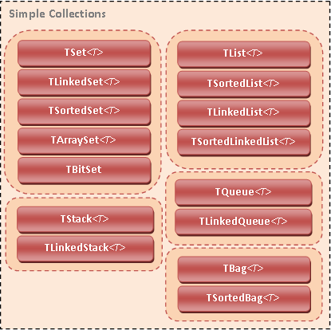
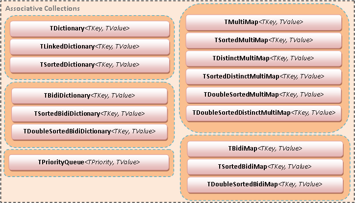

# delphi-coll

Generic collections for Delphi 2010 and later.

## Overview of the library

> This is a fork that attempts to keep alive the  **discontinued** *Delphi Collections Library* by Ciobanu Alexandru. See below for further information about the fork.

### Description

The *Delphi Collections Library* is a package consisting of basic and advanced generic collections for Delphi. This package uses Delphi's standard `Generics.Defaults` and `Generics.Collections` units to access the comparer and equality comparer functionality. The library classes **do not** inherit from the base classes in `Generics.Collections`.

The library is fully documented using XMLDoc in the source code. You can use Help Insight to view function, type and class descriptions directly from the IDE. The library is fully tested using DUnit test cases.

### Requirements

At least Delphi 2010 is required to for the library to function. Delphi 2009 could in principle work, but the great amount of compiler bugs make it hard to use.

### Diagrams

### More info

* [FAQ](doc/FAQ.md)
* [Implementation details](doc/CollectionDetails.md)
* [Enex operations](doc/EnexOperations.md)
* [Difference from standard collections](doc/DifferencesFromGenericsCollections.md)
* [Change log](changelog.txt)

## Information about this fork

This is a fork of the **discontinued** *Delphi Collections Library* by Ciobanu Alexandru as uploaded to GitHub by [ghquant](https://github.com/ghquant). It is believed that the Library was itself branched of the equally defunct *DeHL* library by the same author.

It would seem that the project was discontinued in January 2012.

The code appears to be based on the *Delphi Collections Library* v1.2 release. It is not known whether any commits were made to the code we have here after the release of v1.2. (No history was included in the initial GitHub upload).

This fork has been created because my *CodeSnip* project uses the library. The fork enables me to ensure the code remains available and lets me update and debug it as necessary.

It is not my intention to make any significant changes to the library, but it may get tweaked to meet my needs.

## License

Licensed under the BSD License -- see [LICENSE.txt](LICENSE.txt). The original library is copyright (c) 2008-2012, Ciobanu Alexandru.

## Bugs

Please notify any bugs using the Issue Tracker.

**Note:** This is not a top priority project for me, so I may not fix all bugs. So, if you can, fix the bug yourself and submit your changes. Pull requests are the way to go!

> Using the Wayback Machine a list of [outstanding issues](http://web.archive.org/web/20140312003357/http://code.google.com/p/delphi-coll/issues/list) from the original project has been found, but unfortunately the issue detail pages are not archived, so there's not much to go on.
